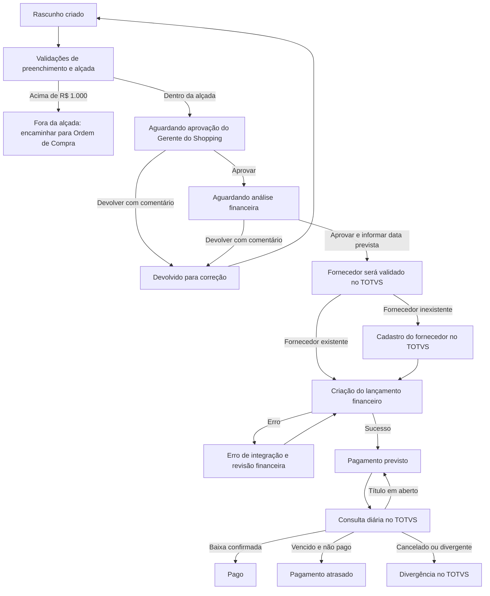

# Projeto FREELANCER

## Pagamentos de Prestadores Eventuais

**Status:** especificação pré-implantação, sem alteração de banco ou código da aplicação.

Este documento registra a proposta funcional e os pontos que precisam ser fechados antes da implantação. O fluxo envolve aprovação financeira, CPF, documentos assinados e criação de lançamentos no TOTVS.

A proposta é viável, mas há cinco pontos críticos: limite semanal de R$ 1.000, enquadramento fiscal e trabalhista, poderes do novo perfil, integridade das aprovações e prevenção de lançamentos duplicados no TOTVS.

## 1. Nome recomendado

Para o módulo:

**Pagamentos de Prestadores Eventuais**

Para substituir “folha de ponto”:

**Relatório de Serviços Prestados**

No botão de anexação:

**Comprovante assinado dos serviços prestados**

“Folha de ponto” e “jornada” são expressões normalmente relacionadas a emprego. O nome não muda a natureza da relação, mas é importante que Jurídico e Departamento Pessoal avaliem o processo: a CLT diferencia o empregado e o autônomo, e o cumprimento das formalidades é relevante. [CLT, artigos 3º e 442-B](https://www.planalto.gov.br/ccivil_03/decreto-lei/del5452.htm).

## 2. Primeira fragilidade: limite de R$ 1.000

A regra “R$ 1.000 por lançamento” é frágil porque permite dividir R$ 1.500 em dois lançamentos de R$ 750.

Recomendação:

- O limite deve ser semanal e acumulado.
- O sistema deve somar todos os serviços do mesmo CPF na mesma semana.
- O valor deve ser configurável no banco, não fixado no código.
- R$ 1.000,00 é permitido.
- Acima de R$ 1.000,00 não segue para lançamento financeiro comum.
- A solicitação é direcionada para o processo de Ordem de Compra.
- Solicitações devolvidas, pendentes e aprovadas devem entrar na verificação para impedir lançamentos simultâneos.
- Solicitações canceladas ou definitivamente rejeitadas não entram na soma.

A decisão mais importante é definir a chave da alçada:

1. `CPF + semana + coligada`; ou
2. `CPF + semana em todo o grupo`, independentemente da coligada.

Para impedir que o valor seja dividido entre shoppings ou empresas, recomenda-se considerar o total do CPF no grupo durante a semana. Se a regra contábil for por empresa, o sistema poderá bloquear por coligada e emitir também um alerta consolidado do grupo.

Também é necessário decidir:

- A semana será de segunda-feira a domingo?
- O cálculo seguirá o fuso `America/Sao_Paulo`?
- Se um prestador tiver R$ 600 já lançado e depois aparecer outro serviço de R$ 500, somente o novo valor seguirá para Ordem de Compra ou todo o conjunto semanal deverá ser tratado por OC?

Recomenda-se que o conjunto semanal inteiro siga a mesma modalidade sempre que ainda não houver pagamento processado.

## 3. Estrutura recomendada da solicitação

Uma solicitação deve representar:

> Um prestador + um shopping + uma coligada + um centro de custo + uma semana.

Dentro dela podem existir vários dias trabalhados.

### Cabeçalho

- Número interno da solicitação
- Shopping
- Empresa/coligada
- Centro de custo
- CPF do prestador
- Nome do prestador
- Código do fornecedor no TOTVS, quando existir
- Situação do fornecedor no TOTVS
- Semana de referência
- Gerente do Shopping responsável pela aprovação
- Valor total calculado
- Situação da solicitação
- Usuário criador
- Data e hora da criação
- Versão da solicitação

### Dias de serviço

Cada dia deve conter:

- Data do serviço
- Horário inicial
- Horário final
- Intervalo, quando aplicável
- Quantidade de horas calculada
- Tipo de serviço
- Valor daquele serviço
- Observação

O total da solicitação deve ser calculado pelo sistema. O usuário não deve conseguir digitar um total diferente da soma dos dias.

Datas de serviço devem ser gravadas como `DATE`, sem conversão de fuso horário. Datas e horas de aprovação devem ser armazenadas com horário e fuso. Valores devem usar campo decimal, nunca número de ponto flutuante.

## 4. Fluxo recomendado

### Status necessários

- `RASCUNHO`
- `AGUARDANDO_APROVACAO_SHOPPING`
- `DEVOLVIDO_PELO_SHOPPING`
- `APROVADO_PELO_SHOPPING`
- `AGUARDANDO_FINANCEIRO`
- `DEVOLVIDO_PELO_FINANCEIRO`
- `APROVADO_PELO_FINANCEIRO`
- `FORA_DA_ALCADA`
- `AGUARDANDO_ORDEM_COMPRA`
- `VALIDANDO_FORNECEDOR`
- `CADASTRANDO_FORNECEDOR`
- `AGUARDANDO_INTEGRACAO_TOTVS`
- `INTEGRANDO_TOTVS`
- `ERRO_INTEGRACAO`
- `PAGAMENTO_PREVISTO`
- `PAGO`
- `ATRASADO`
- `DIVERGENTE`
- `CANCELADO`

Depois do envio para aprovação, a solicitação não deve ser excluída fisicamente. Ela deve ser cancelada, mantendo seu histórico.

## 5. Novo perfil `GERENTE_FINANCEIRO`

Não se recomenda implementar tecnicamente como uma simples cópia do `GERENTE_CSC`.

“Mesmas atribuições” pode conceder involuntariamente:

- Administração de usuários
- Alteração de perfis
- Acesso a configurações administrativas
- Acesso a funcionalidades que não têm relação com pagamentos
- Permissão para criar e aprovar a própria solicitação

A recomendação é criar permissões específicas:

| Capacidade | `GERENTE_FINANCEIRO` |
| --- | ---: |
| Visualizar todos os shoppings | Sim |
| Visualizar solicitações de prestadores | Sim |
| Aprovar financeiramente | Sim |
| Informar data prevista de pagamento | Sim |
| Enviar lançamentos ao TOTVS | Sim |
| Reprocessar integração com erro | Sim |
| Consultar fornecedores | Sim |
| Cadastrar fornecedor via fluxo aprovado | Sim |
| Administrar usuários | Não, salvo decisão explícita |
| Aprovar como Gerente do Shopping | Não |
| Aprovar solicitação criada por ele próprio | Não |

O controle deve ser realizado no servidor. Ocultar botões na página não é suficiente.

Também é necessário definir quais perfis podem criar solicitações. Recomendação:

- `MESTRE`
- `GERENTE_CSC`
- `GERENTE_SHOPPING`
- Um eventual perfil operacional específico, vinculado ao shopping

## 6. Escolha do Gerente do Shopping

O usuário poderá escolher o aprovador, mas somente entre:

- Usuários ativos;
- Com perfil `GERENTE_SHOPPING`;
- Vinculados ao shopping da solicitação;
- Diferentes do usuário que criou a solicitação.

Pontos que precisam ser definidos:

- O que acontece se não existir gerente vinculado?
- Quem substitui um gerente afastado?
- Quem pode reatribuir uma aprovação parada?
- Qual o prazo esperado para aprovação?
- Haverá lembrete automático depois de um ou dois dias?

Recomenda-se permitir reatribuição somente por `MESTRE`, `GERENTE_CSC` ou `GERENTE_FINANCEIRO`, sempre com justificativa e registro no histórico.

## 7. Como tornar a aprovação segura

Uma aprovação segura não deve ser apenas um campo como `aprovado = sim`.

Cada decisão deve gerar um registro permanente contendo:

- Identificador da solicitação
- Versão aprovada
- Identificador imutável do usuário
- Nome e e-mail do usuário naquele momento
- Perfil utilizado
- Decisão: aprovado, devolvido ou cancelado
- Comentário
- Data e hora geradas pelo servidor
- Endereço IP
- Identificador da sessão
- Estado anterior e novo estado
- Resumo dos dados financeiros aprovados
- Código de verificação do documento anexado
- Código de verificação do conteúdo da solicitação

Boas práticas:

- O registro de aprovação não pode ser editado ou apagado.
- Toda mudança de status deve gerar um novo evento.
- Aprovação e mudança de status devem acontecer na mesma transação do banco.
- Alterar CPF, valor, datas, centro de custo, coligada, shopping ou anexo após aprovação deve invalidar as aprovações anteriores.
- A edição cria uma nova versão da solicitação.
- A nova versão volta ao Gerente do Shopping.
- A aprovação financeira final deve exigir nova confirmação de senha ou autenticação reforçada.
- Comentário deve ser obrigatório ao devolver ou cancelar.
- A mesma pessoa não pode criar, aprovar pelo shopping e aprovar financeiramente.

O documento anexado deve possuir uma identificação criptográfica, como SHA-256. Assim é possível demonstrar que o arquivo consultado posteriormente é o mesmo que estava presente no momento da aprovação.

## 8. Documento assinado

Recomenda-se aceitar inicialmente:

- PDF
- JPG
- JPEG
- PNG
- XLSX, sem macros

Não aceitar:

- Arquivos executáveis
- Planilhas com macros
- Arquivos protegidos por senha
- Formatos antigos sem validação
- Arquivos cujo conteúdo real não corresponde à extensão

O arquivo deve ficar em armazenamento privado, preferencialmente Azure Blob Storage, e o banco deve guardar:

- Nome original
- Nome interno
- Tipo
- Tamanho
- Código SHA-256
- Usuário que anexou
- Data de envio
- Versão da solicitação
- Localização privada do arquivo

O download deve exigir autenticação e autorização por shopping. Links públicos permanentes não devem ser utilizados.

Uma foto de documento assinado é uma evidência básica, mas não equivale automaticamente a uma assinatura digital verificável. Se for necessária validade mais forte, será preciso integrar posteriormente uma plataforma de assinatura eletrônica.

O arquivo será evidência; os dados digitados no formulário continuarão sendo a fonte usada para aprovação e integração. O sistema não deve confiar automaticamente em valores extraídos da foto ou da planilha.

## 9. Validação do fornecedor

Consultar somente pelo CPF pode não ser suficiente. É necessário mapear como o fornecedor existe no TOTVS:

- Existe um código por CPF?
- O mesmo CPF pode possuir códigos diferentes por coligada?
- Fornecedores inativos devem ser reativados ou cadastrados novamente?
- Há fornecedores bloqueados para pagamento?
- O TOTVS retorna nome, status e coligadas disponíveis?
- Como tratar cadastros duplicados?

Quando o CPF não existir, a API de inclusão provavelmente exigirá outros dados:

- Nome completo
- CPF
- Data de nascimento, se exigida
- Endereço
- Município e estado
- Telefone
- E-mail
- Dados bancários
- Dados fiscais
- Natureza ou classificação do fornecedor
- Coligada
- Forma de pagamento
- Documentos comprobatórios

Esses campos precisam ser confirmados no contrato da API antes do desenho da tela.

O CPF deve:

- Ter dígitos verificadores validados;
- Ser armazenado protegido;
- Aparecer mascarado nas listas e relatórios;
- Nunca aparecer em URL ou log;
- Ser exibido por completo somente a usuários autorizados.

A LGPD exige medidas técnicas e administrativas desde a concepção do sistema para proteger dados pessoais contra acessos e alterações indevidos. Isso vale especialmente para CPF, assinatura, endereço e dados bancários. [Lei Geral de Proteção de Dados, artigos 37, 38 e 46](https://www.planalto.gov.br/ccivil_03/_ato2015-2018/2018/lei/l13709compilado.htm).

## 10. Questão fiscal que precisa ser resolvida antes da API

O valor informado é:

- Valor bruto do serviço?
- Valor líquido que o prestador receberá?
- Haverá INSS?
- Haverá IRRF?
- Haverá ISS?
- O TOTVS calculará as retenções?
- A API receberá os valores já calculados?
- Será emitido RPA?
- Quem gera e disponibiliza o comprovante ao prestador?

A Receita Federal diferencia pagamentos a pessoa física sem relação com o trabalho, informados na EFD-Reinf, daqueles relacionados ao trabalho, tratados no eSocial. Portanto, Contabilidade, Fiscal e Jurídico devem definir o enquadramento antes de automatizar o lançamento. [Orientação da Receita Federal sobre EFD-Reinf](https://www.gov.br/receitafederal/pt-br/acesso-a-informacao/perguntas-frequentes/sped/efd-reinf/efdr/1-geral/1-17-as-informacoes-sobre).

O sistema não deve presumir que o valor digitado é automaticamente o valor líquido a pagar.

## 11. Integração segura com o TOTVS

A integração deve acontecer somente no servidor.

Cada solicitação deve receber uma chave única de integração. Mesmo que a API demore ou o Portal tente novamente, o sistema não poderá criar dois fornecedores ou dois lançamentos.

Para cada chamada devem ser registrados:

- Operação executada
- Chave de idempotência
- Data e hora
- Número da tentativa
- Status HTTP
- Código retornado pelo TOTVS
- Identificador do fornecedor criado
- Identificador do lançamento financeiro
- Mensagem de erro tratada
- Próxima tentativa prevista

Não se deve guardar em log:

- Senhas
- Tokens
- CPF completo
- Dados bancários
- Corpo integral da requisição quando contiver dados pessoais

Se dez lançamentos forem aprovados e apenas sete forem incluídos, os sete devem ficar como sucesso e os três como erro. Reprocessar o lote não poderá duplicar os sete já incluídos.

## 12. Data prevista e baixa

O Gerente Financeiro deve informar a **data prevista de pagamento**, não “data de pagamento”.

A data real será preenchida somente quando o TOTVS confirmar a baixa.

Status recomendados:

- `PAGAMENTO_PREVISTO`: título aberto e ainda dentro do prazo;
- `ATRASADO`: data prevista vencida e título ainda aberto;
- `PAGO`: baixa confirmada pelo TOTVS;
- `DIVERGENTE`: valor, situação ou baixa incompatível;
- `CANCELADO_NO_TOTVS`: lançamento cancelado;
- `PAGO_PARCIALMENTE`: quando o TOTVS permitir baixa parcial.

A consulta diária deve:

- Rodar em horário configurado;
- Consultar somente títulos ainda não encerrados;
- Ter novas tentativas se o TOTVS estiver indisponível;
- Mostrar no painel a data da última sincronização;
- Alertar a equipe financeira quando a sincronização falhar;
- Permitir atualização manual por usuário autorizado;
- Registrar valor e data efetiva da baixa.

## 13. Estrutura conceitual do banco

Ainda sem criar SQL, a estrutura provável será:

- `prestador_solicitacao`: cabeçalho e estado atual;
- `prestador_servico_item`: dias, horários, tipo e valor;
- `prestador_anexo`: documentos e versões;
- `prestador_aprovacao`: decisões imutáveis;
- `prestador_historico_status`: linha do tempo;
- `prestador_lote_financeiro`: relatório ou lote aprovado pelo Financeiro;
- `prestador_lote_item`: solicitações incluídas no lote;
- `prestador_integracao_totvs`: chamadas, tentativas e respostas;
- `prestador_reconciliacao_totvs`: consultas de baixa;
- `prestador_tipo_servico`: catálogo de serviços;
- `prestador_regra_alcada`: limite, vigência e abrangência;
- `shopping_configuracao_financeira`: coligada, centro de custo e configurações do shopping.

As aprovações, históricos e integrações devem ser adicionados, nunca sobrescritos.

## 14. Painéis necessários

### Usuário criador

- Meus rascunhos
- Aguardando aprovação
- Devolvidos para correção
- Aprovados
- Pagamento previsto
- Pagos
- Com erro
- Fora da alçada

### Gerente do Shopping

- Pendentes de minha aprovação
- Aprovados por mim
- Devolvidos
- Pagamentos do meu shopping
- Linha do tempo de cada solicitação

### Gerente Financeiro

- Aguardando análise financeira
- Fornecedores não cadastrados
- Prontos para envio
- Erros de integração
- Pagamentos previstos
- Pagamentos atrasados
- Pagos
- Divergências no TOTVS
- Relatório por shopping, coligada, centro de custo, período e prestador

## 15. Principais pontos de fragilidade

- Divisão artificial do valor em vários lançamentos;
- Solicitações simultâneas para o mesmo CPF;
- Usuário aprovando a própria solicitação;
- Escolha indevida de aprovador;
- Alteração dos dados depois da aprovação;
- Exclusão física do histórico;
- Documento substituído depois da aprovação;
- Arquivo malicioso ou planilha com macro;
- CPF exposto em logs, telas ou exportações;
- Fornecedor duplicado no TOTVS;
- Retorno incerto da API gerando lançamento duplicado;
- Sucesso parcial de um lote;
- Confusão entre data prevista e data efetiva;
- Consulta diária falhar silenciosamente;
- Centro de custo ou coligada digitados livremente;
- Valor bruto tratado como líquido;
- Retenções tributárias não consideradas;
- Relação recorrente com prestadores gerar risco trabalhista;
- Gerente Financeiro receber poderes administrativos excessivos;
- Datas de serviço sofrerem conversão de fuso;
- Duas pessoas aprovarem ou editarem simultaneamente.

## 16. Decisões pendentes

Antes de partir para os arquivos de implantação, é necessário fechar:

1. Quem poderá criar solicitações?
2. O Gerente Financeiro poderá administrar usuários ou somente atuar no financeiro?
3. A alçada semanal será por CPF e coligada ou por CPF em todo o grupo?
4. A semana será sempre de segunda a domingo?
5. Ao ultrapassar R$ 1.000, todo o conjunto semanal irá para OC?
6. O Portal apenas bloqueará ou também acompanhará o número da Ordem de Compra?
7. Uma solicitação poderá conter vários dias da mesma semana?
8. O prestador poderá atender mais de um shopping na mesma semana?
9. O criador poderá escolher qualquer gerente vinculado ou haverá um gerente principal por shopping?
10. O Gerente Financeiro poderá devolver a solicitação para correção?
11. Qual é o valor bruto e quais retenções devem ser calculadas?
12. Quem preencherá os dados necessários para um novo fornecedor?
13. Quais campos a API de fornecedor exige?
14. O TOTVS possui ambiente de homologação?
15. Qual campo do TOTVS representa a data prevista?
16. Quais códigos identificam título aberto, baixado, cancelado e pagamento parcial?
17. O arquivo assinado será obrigatório em todos os casos?
18. Excel será aceito como comprovante final ou apenas PDF/foto?
19. Por quanto tempo os documentos deverão ser armazenados?
20. Haverá prazo e notificações automáticas para cada aprovação?

## 17. Ordem futura de construção

Depois que as decisões forem respondidas, a implantação deverá seguir aproximadamente:

1. Validação Jurídica, Fiscal e Contábil;
2. Matriz de perfis e permissões;
3. Especificação dos campos das APIs TOTVS;
4. Desenho das telas e estados;
5. Estrutura do banco e auditoria;
6. Fluxo de criação e aprovação sem integração;
7. Armazenamento seguro dos anexos;
8. Integração de consulta e cadastro de fornecedor;
9. Integração de lançamento financeiro;
10. Consulta diária de baixas;
11. Painéis, notificações e exportações;
12. Testes de acesso, duplicidade e segurança;
13. Homologação com dados fictícios;
14. Piloto controlado em um shopping;
15. Liberação gradual para todos.

## Regra obrigatória do Portal GMV: acesso por shopping

Qualquer implementação futura deste projeto deve seguir integralmente [o controle de acesso por shopping](../controle-acesso-por-shopping.md), além das regras do `AGENTS.md` do repositório.

Em especial:

- Somente `MESTRE` e `GERENTE_CSC` possuem hoje escopo global. A eventual inclusão de `GERENTE_FINANCEIRO` nesse escopo deve ser uma decisão explícita e implementada no servidor.
- `GERENTE_SHOPPING` pode acessar exclusivamente os shoppings vinculados ao usuário em `portal_usuario_shopping`.
- Os vínculos devem ser consultados pelo `req.user.id` no banco.
- Usuário restrito sem vínculo não recebe acesso geral.
- IDs recebidos pela interface ou API não são confiáveis; deve-se usar somente a interseção com o escopo autorizado.
- O escopo deve ser aplicado antes de agregação, paginação, exportação, acesso a anexos, cache, tarefas em segundo plano e qualquer integração ou relatório.
- Os testes devem cobrir acesso global autorizado, acesso restrito aos vínculos, tentativa de informar shopping não autorizado e usuário restrito sem vínculos.

## Condição para implantação

Nenhuma construção de banco, tela, API ou integração TOTVS deve começar como regra definitiva antes de serem respondidas as decisões do item 16 e validados os aspectos Jurídico, Fiscal, Contábil e de proteção de dados.
